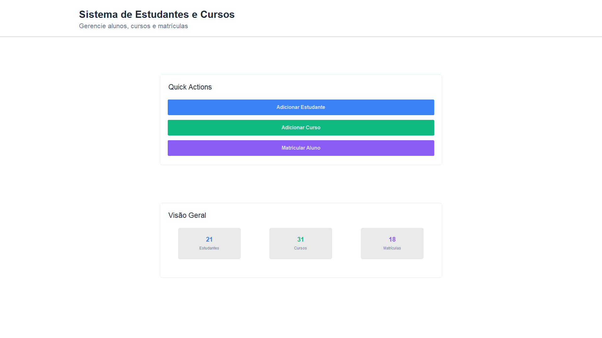

# 🎓 Sistema de Gerenciamento de Estudantes, Cursos e Matrículas

Uma interface gráfica moderna desenvolvida com **Python + CustomTkinter + ttkbootstrap**, conectada a um banco de dados **MySQL**, que permite cadastrar, visualizar e gerenciar alunos, cursos e matrículas em tempo real.



---

## 🚀 Funcionalidades

✅ Adicionar estudantes com nome, e-mail e data de nascimento  
✅ Cadastrar novos cursos com preço  
✅ Matricular alunos em cursos  
✅ Atualização em tempo real dos contadores de alunos, cursos e matrículas  
✅ Conexão com banco de dados MySQL  
✅ Interface visual moderna, com popups centralizados e interativos  

---

## 🖼️ Interface do Sistema

A interface está dividida em três seções principais:

- **Ações rápidas** (botões para adicionar aluno, curso ou matrícula)
- **Dashboard de visão geral** com contagem atualizada
- **Popups com formulários modernos para entrada de dados**
- 

---

## 🛠️ Tecnologias Utilizadas

- Python 3.10+
- [CustomTkinter](https://github.com/TomSchimansky/CustomTkinter)
- [ttkbootstrap](https://github.com/israel-dryer/ttkbootstrap)
- MySQL (com ODBC)
- pyodbc

---

## 📦 Instalação

1. Clone o repositório:

```bash
git clone https://github.com/nicolasandreos/Mysql-TKinter
cd Mysql-TKinter
````

2. Instale os pacotes necessários:

```bash
pip install customtkinter ttkbootstrap pyodbc
```

3. Certifique-se de ter o driver ODBC instalado:
   👉 `MySQL ODBC 9.4 Unicode Driver` (ou adapte no `DADOS_CONEXAO`)

---

## 🔌 Banco de Dados

A aplicação utiliza um banco MySQL chamado `db_exemplo` com as seguintes tabelas:

```sql
CREATE TABLE alunos (
  ID_Aluno INT AUTO_INCREMENT PRIMARY KEY,
  Nome VARCHAR(255),
  Email VARCHAR(255),
  Data_Nascimento DATE
);

CREATE TABLE cursos (
  ID_Curso INT AUTO_INCREMENT PRIMARY KEY,
  Nome VARCHAR(255),
  Preco DECIMAL(10, 2)
);

CREATE TABLE matriculas (
  ID_Matricula INT AUTO_INCREMENT PRIMARY KEY,
  ID_Aluno INT,
  ID_Curso INT,
  Data_Matricula DATE
);
```

---

## ▶️ Como Executar

```bash
python interface.py
```

O sistema abrirá em **tela cheia**, com atalhos de segurança:

* Pressione `Esc` para sair do programa

---

## 📄 Licença

Este projeto está sob a licença MIT.
Sinta-se livre para modificar, compartilhar ou utilizar em seus próprios projetos!

