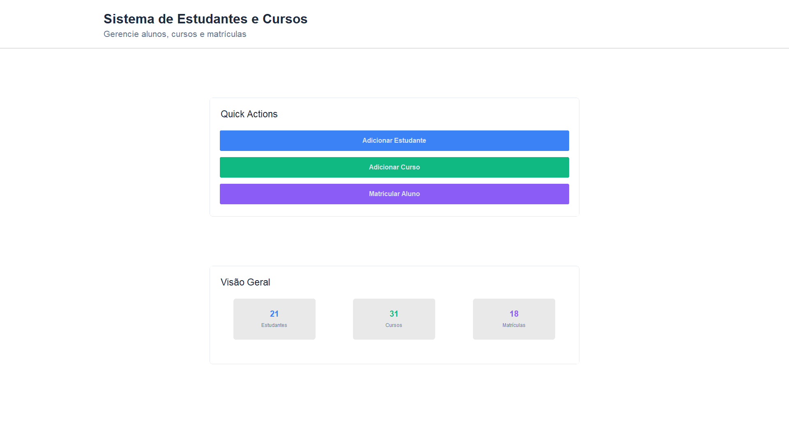

# 🎓 Student, Course & Enrollment Management System

A modern desktop interface built with **Python + CustomTkinter + ttkbootstrap**, connected to a **MySQL** database, allowing users to register, view, and manage students, courses, and enrollments in real time.

---

## 🚀 Features

✅ Add students with name, email, and birth date  
✅ Create new courses with pricing  
✅ Enroll students in courses  
✅ Real-time dashboard counters (students, courses, enrollments)  
✅ MySQL database integration  
✅ Modern UI with centered, interactive popups  

---

## 🖼️ System Interface

The interface is divided into three main sections:

- **Quick Actions** (buttons to add students, courses, or enrollments)
- **Overview Dashboard** with live counters
- **Modern popup forms** for structured data input

---

## 📸 Screenshots

### 🏠 Main Dashboard


> 📌 You can add more screenshots inside the `fotos/` folder and reference them here.

---

## 🛠️ Technologies Used

- Python 3.10+
- CustomTkinter
- ttkbootstrap
- MySQL (via ODBC)
- pyodbc

---

## 📦 Installation

1. Clone the repository:

```bash
git clone https://github.com/nicolasandreos/Mysql-TKinter
cd Mysql-TKinter
```

2. Install the required packages:

```bash
pip install customtkinter ttkbootstrap pyodbc
```

3. Make sure you have the ODBC driver installed:  
   👉 `MySQL ODBC 9.4 Unicode Driver`  
   (Or update the `DADOS_CONEXAO` configuration accordingly.)

---

## 🔌 Database Setup

The application uses a MySQL database called `db_exemplo` with the following tables:

```sql
CREATE TABLE alunos (
  ID_Aluno INT AUTO_INCREMENT PRIMARY KEY,
  Nome VARCHAR(255),
  Email VARCHAR(255),
  Data_Nascimento DATE
);

CREATE TABLE cursos (
  ID_Curso INT AUTO_INCREMENT PRIMARY KEY,
  Nome VARCHAR(255),
  Preco DECIMAL(10, 2)
);

CREATE TABLE matriculas (
  ID_Matricula INT AUTO_INCREMENT PRIMARY KEY,
  ID_Aluno INT,
  ID_Curso INT,
  Data_Matricula DATE
);
```

---

## ▶️ How to Run

```bash
python interface.py
```

The system will open in **fullscreen mode**, with safety shortcuts:

- Press `Esc` to exit the application

---

## 🎯 Learning Objectives

This project was developed to practice:

- Desktop GUI development with Python
- Database integration using ODBC
- CRUD operations with MySQL
- Real-time UI updates
- Clean UI architecture and user experience

---

## 📄 License

This project is licensed under the MIT License.  
Feel free to modify, share, or use it in your own projects.
